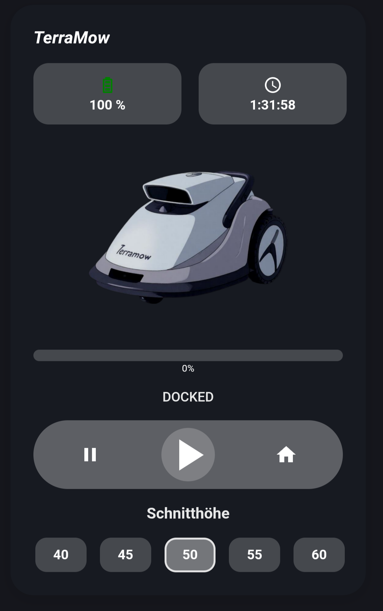

# TerraMow Home Assistant Dashboard Card using custom:button-card

A beautiful, animated dashboard card for TerraMow lawn mowers in Home Assistant with real-time progress tracking and full control interface.

## Features

- **Dynamic Background Colors**: Changes based on mower state (green for mowing, yellow for paused, red for errors)
- **Animated Mower Image**: Vibration animation when actively mowing
- **Progress Bar**: Real-time progress tracking with estimated time remaining
- **Battery & Session Info**: Quick view of battery level and current session time
- **Full Control**: Start, pause, and dock buttons
- **Cutting Height Control**: Easy selection of mowing height (40-60mm)
- **Smart State Display**: Clear status indication with proper formatting

## Screenshots

## Requirements

- Home Assistant with HACS
- [Button Card](https://github.com/custom-cards/button-card) custom component
- TerraMow lawn mower integration

## Installation

### 1. Install Button Card

Install the Button Card component via HACS:
1. Go to HACS → Frontend
2. Search for "Button Card"
3. Install the component
4. Restart Home Assistant

### 2. Add Custom Image

1. Create the directory `/config/www/picture/` if it doesn't exist
2. Place your TerraMow image as `terramow_comic.png` in this directory
3. The image should be roughly square and will be displayed at 140px height

### 3. Add Custom Sensor

Add the template sensor to your `configuration.yaml`:

### 4. Add the Card

Copy the complete card configuration from `terramow-card.yaml` and paste it into your dashboard in edit mode.

## Customization

### Adjust Mowing Duration
Change the `total_minutes` value in the sensor template (default: 90 minutes) to match your typical mowing session length.

### Entity Names
If your TerraMow entities have different names, update these in the card configuration:
- `lawn_mower.terramow_lawn_mower`
- `sensor.terramow_battery`
- `sensor.terramow_current_session_time`
- `number.terramow_mowing_height_setting`

### Cutting Heights
Modify the height button values (currently 40, 45, 50, 55, 60mm) in the `height_buttons` section to match your mower's available settings.

### Colors and Styling
The card uses CSS custom properties. You can customize colors by modifying the style sections in the configuration.

## Troubleshooting

**Card not displaying properly**
- Ensure Button Card is installed and Home Assistant is restarted
- Check that all entity names match your actual entities

**Image not showing**
- Verify the image path: `/local/picture/terramow_comic.png`
- Check file permissions and that the www directory is accessible

**Progress not working**
- Ensure the custom sensor is properly added to configuration.yaml
- Restart Home Assistant after adding the sensor
- Check Developer Tools → States for `sensor.mower_progress`

## Contributing

Feel free to submit issues and enhancement requests!

## License

This project is licensed under the MIT License.
